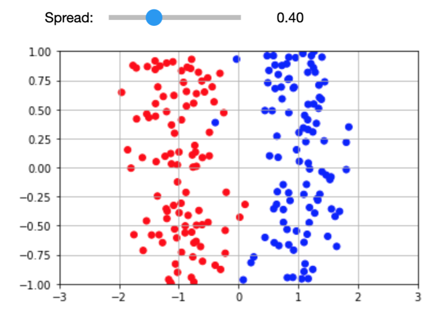
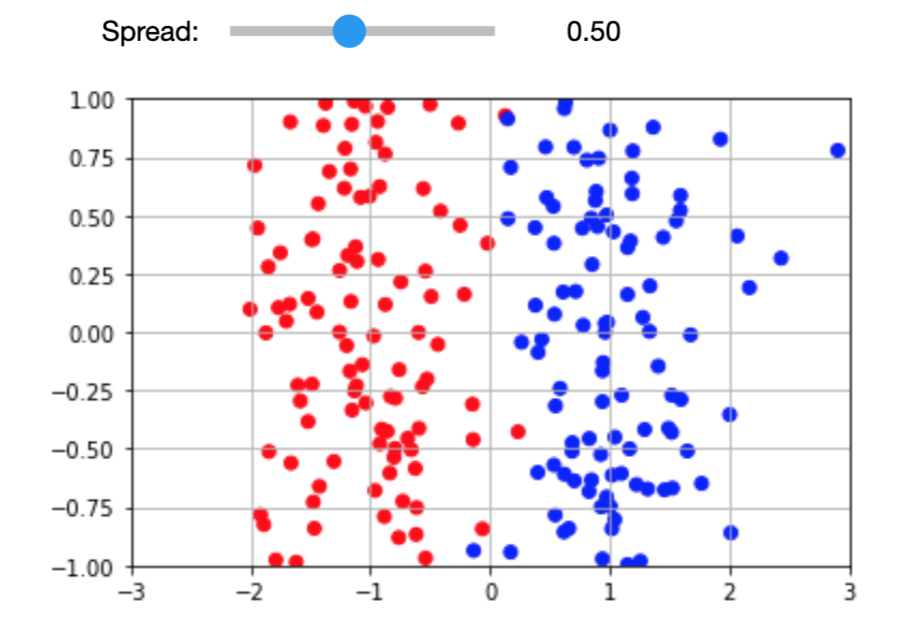
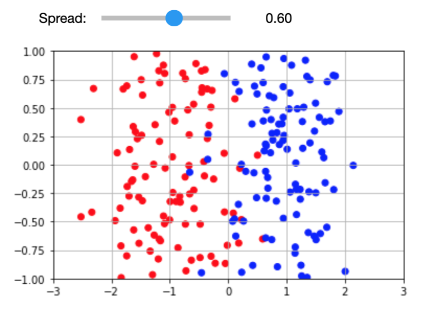
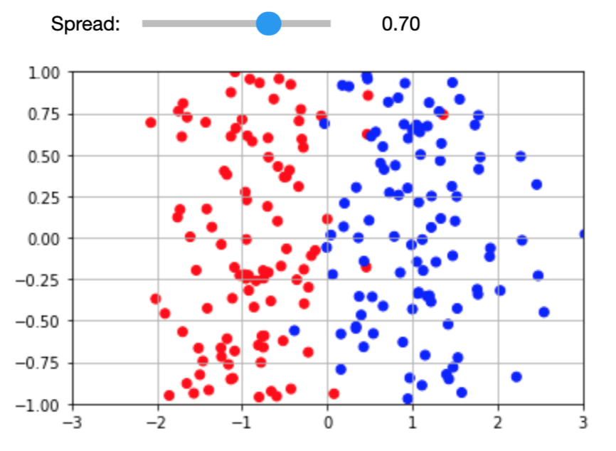
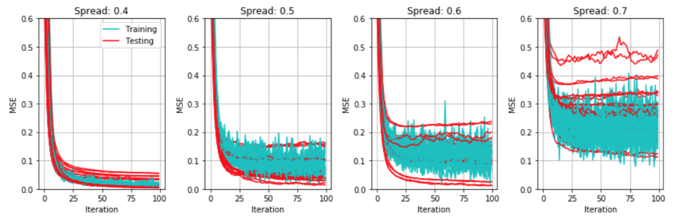

### Machine Learning - Practical Work 2  
#### Samuel Mayor, Alexandra Korukova  

#### 1. Hold Out Validation  
> Q1. Determine where all the aforementioned parameters are defined.  

| spread = 0.4        | spread = 0.5           | spread = 0.6  | spread = 0.7 |  
|:-------------:|:-------------:|:-----:|:-----:|  
|       |  |  |    |  

As we can see, we vary the `spread` parameter from 0.4 to 0.7 with 0.1 step. For every `spread` value we determine the dataset. The dataset is composed of two groups of points (red, blue). Every point is defined by its coordinates (x, y) in the 2-dimensional space. In every group, the points are distributed uniformly within the y axis (from -1 to 1) and normally (gaussian) distributed within the x axis. The red groups of points is distributed around the mean of -1, whereas the blue points are distributed around the mean of 1. The `spread` parameter is actually the value of the standard deviation of each dataset.  
Bigger is the `spread`, more two groups overlap. This is why the classification becomes less performant when we increase the value of the `spread`.  

When we perform the __hold-out validation__, we split the dataset in traning and testing set a certain number of times. We define the `TRAIN_TEST_RATIO`, say 0.8. Then training set will contain 80% of the dataset and the rest of it is used to test the model. Every split training and testing sets contain the random parts of the initial dataset (it is shuffled before the split).

> Q2. What are the cyan and red curves in those plots ? Why are they different ?  

  

__Cyan__ curves represent the Mean Squared Error that the model has on training data, and the __red__ ones represent the values of this error on test data.  

#### 2. Cross-validation  

> Q2. What is the difference between hold-out and cross-validation ? What is the new parameter that has to be defined for cross-validation?  

The __cross-validation__ also uses the `TRAIN_TEST_RATIO` that defines the amount of data used to train/test the model, but this time the dataset is split *k* times to generate *k* so-called folds. We shift the indexes of the the test dataset from one fold to another to generate *k* models. Then we use the average of the results produced by those models as the "final" result.     
