## Machine Learning - Practical Work 2  
### Samuel Mayor, Alexandra Korukova  

### 1. Hold Out Validation  
> Q1. Determine where all the aforementioned parameters are defined.  

| spread = 0.4        | spread = 0.5           | spread = 0.6  | spread = 0.7 |  
|:-------------:|:-------------:|:-----:|:-----:|  
|       |  |  |    |  
*Figure 1*  
__Data__  
As we can see, we vary the `spread` parameter from 0.4 to 0.7 with 0.1 step. For every `spread` value we determine the dataset. The dataset is composed of two groups of points (red, blue). Every point is defined by its coordinates (x, y) in the 2-dimensional space. In every group, the points are distributed uniformly within the y axis (from -1 to 1) and normally (gaussian) distributed within the x axis. The red groups of points is distributed around the mean of -1, whereas the blue points are distributed around the mean of 1. The `spread` parameter is actually the value of the standard deviation of each dataset.  
Bigger is the `spread`, more two groups overlap. This is why the classification becomes less performant when we increase the value of the `spread`.  

__Topology__   
The topology of the NN is defined while the MLP initialization:
> nn = mlp.MLP([2,N_NEURONS,1], 'tanh')  

As we can see, our NN has 2 inputs, `N_NEURONS`=2 neurons in the hidden layer and 1 output.  

__Configuration__  
The configuration of the NN is defined with the constants:
```
N_INITS = 2
N_SPLITS = 10
DATASET_SIZE = 200
EPOCHS = 100
N_NEURONS = 2
LEARNING_RATE = 0.001
MOMENTUM = 0.7
TRAIN_TEST_RATIO = 0.8
DATA_PARAMS = np.arange(0.4, 0.71, 0.1)  
```


When we perform the __hold-out validation__, we split the dataset in traning and testing set a certain number of times. We define the `TRAIN_TEST_RATIO`, say 0.8. Then training set will contain 80% of the dataset and the rest of it is used to test the model. Every split training and testing sets contain the random parts of the initial dataset (it is shuffled before the split).

> Q2. What are the cyan and red curves in those plots ? Why are they different ?  

  
*Figure 2*  

__Cyan__ curves represent the Mean Squared Error that the model has on training data, and the __red__ ones represent the values of this error on test data. In other words, __cyan__ curves show the evaluation of the MSE for the data that the model has already perceived and the __red__ ones show the evaluation on the new data. They are different, because the model can have different performances on the training and test data.  

> Q3. What happens with the training and test errors (MSE) when the 2 sets overlap significantly ?  

When two sets overlap significantly, it becomes difficult for the system to attribute a class (-1, 1) to the input. As the *Figure 2* shows, the MSE values are generally higher for the high values of the `spread`. However, some models have a good performance even in the case when the `spread` value is high.   

> Q4. Why does the red curves sometimes indicate a higher error than the cyan ones ?  

The red curves indicate the higher error than the cyan ones in case of the __poor generalization capability__ of the model. This means that the system performs more or less well on the training data, but does not attribute the right class to the points from the test dataset. The reason is probably __overfitting__: the model is overtrained and thus "memorised" the training dataset.  

> Q5. What is the boxplot summarizing the validation errors of the preceding experiments showing ?  

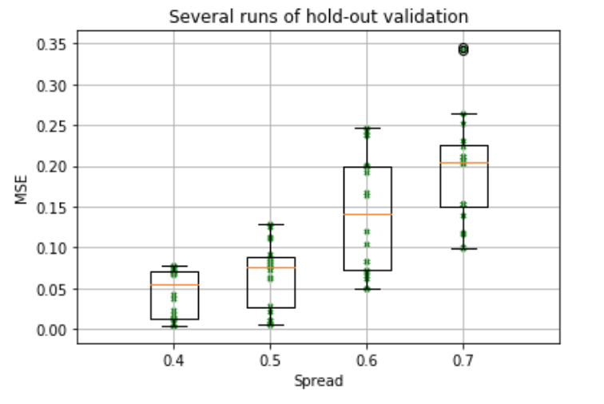  
*Figure 3*

The boxplots show the __dispersion__ of the testing MSE for every `spread` value.   
*Note:* the values of the MSE used for the boxplots are those that correspond to the last iteration (epoch).  
Firstly, the boxplots show that the __dispersion__ of the MSE grows with the `spread`. Second, the __median__ value of the MSE grows with the `spread`. These results are logic, because as we mentioned before, bigger is the `spread`, harder it is to solve our classification problem, since two datasets overlap more and more.   


### 2. Cross-validation  

> Q1. Determine where all the aforementioned parameters are defined.  

The __dataset__  and the __topology__ remain the same. The configuration is also defined by the constants:
```
N_SPLITS = 10
DATASET_SIZE = 200
EPOCHS = 20
N_NEURONS = 2
K = 5
LEARNING_RATE = 0.001
MOMENTUM = 0.7
DATA_PARAMS = np.arange(0.4, 0.71, 0.1)
```
As we can see, there is no more `TRAIN_TEST_RATIO`, but the new `K` parameter appears.  

> Q2. What is the difference between hold-out and cross-validation ? What is the new parameter that has to be defined for cross-validation?  

As for the __hold-out__ validation, the data is shuffled first. Then it is split into *k* parts. To generate a model, *k-1* parts are used for training and the remaining part of the data is used for testing. We shift the part used for testing *k* times to generate *k* models (this is done with `mlp.init_weights()` for every model). Then we use the average of the results produced by those models as the "final" result.     
The parameter that has to be defined is *k*: it defines the number of so-called data folds. It also defines the number of models generated by the system.  

> Q3. Observe the boxplots summarizing the validation errors obtained using the cross-validation method and compare them with those obtained by hold-out validation.  

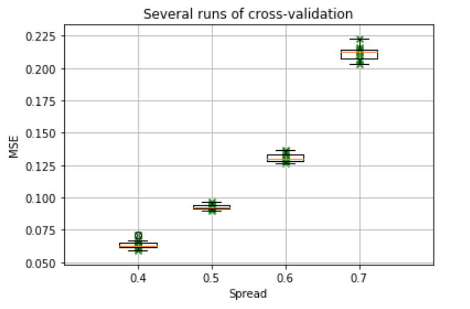  
*Figure 4*  

As the *Figure 4* shows, the __median__ of the error still grows with the `spread` and its values remain pretty much the same. However, the __dispersion__ of the MSEs is much lower comparing to the hold-out validation. This means that the results obtained with the __k-fold cross-validation__ are much more stable than those obtained with the __hold-out__ validation.  
This can be the result of several manipulations performed to obtain the final result:
* We split the data *k* times into training and test sets. This is why the class attributed to the input has much less chances to be the result of lucky/unlucky initialization.  
* We use the average result among *k* generated models. It also makes the dispersion of the MSE lower.   

### 3. Speaker recognition experiments   
To extract the data, we first read all the audios with `scipy.io.wavfile` library and tranformed the result into features using `mfcc` tool.
The resulting dataset is composed of 360 2d lists. Every list represents a fragment of an audio. All of 13 features are calculated for each fragment.  

#### 3.1. Man vs Woman   
Now we're only interested in fragments corresponding to *Natural Adult Male* and *Natural Adult Female* voices. We first extract them from the initial dataset and then align all the data by feature.  

Now we have to find the convenient __hyperparameters__ for our Neural Network:
* The number of neurons (*N*) in the hidden layer  
* The number of epochs  
* Learning rate (*L*)
* Momentum (*M*)  

__Learning Rate__  
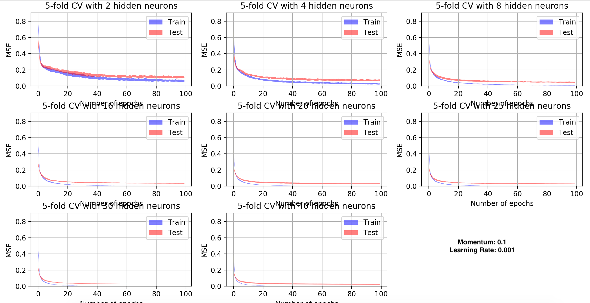  
*Figure 5*  
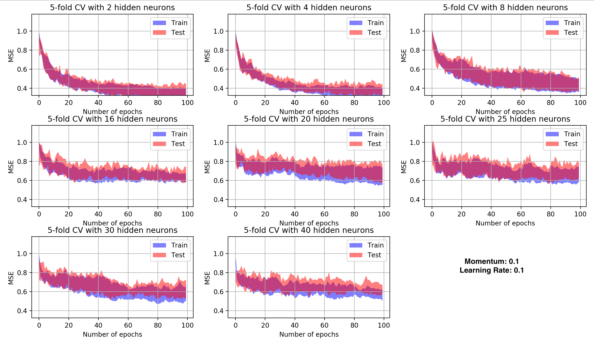  
*Figure 6*  

*Figure 5* shows the Mean Squared Error for the Learning Rate equal to 0.001 and the *Figure 6* shows the MSE for *L* equal to 0.1. As we can see, the performance of the system gets drastically worse when the value of the Learning Rate increases. To refine this value, we can perform the tests for the *L* values between 0.001 and 0.1.  

__Momentum__  
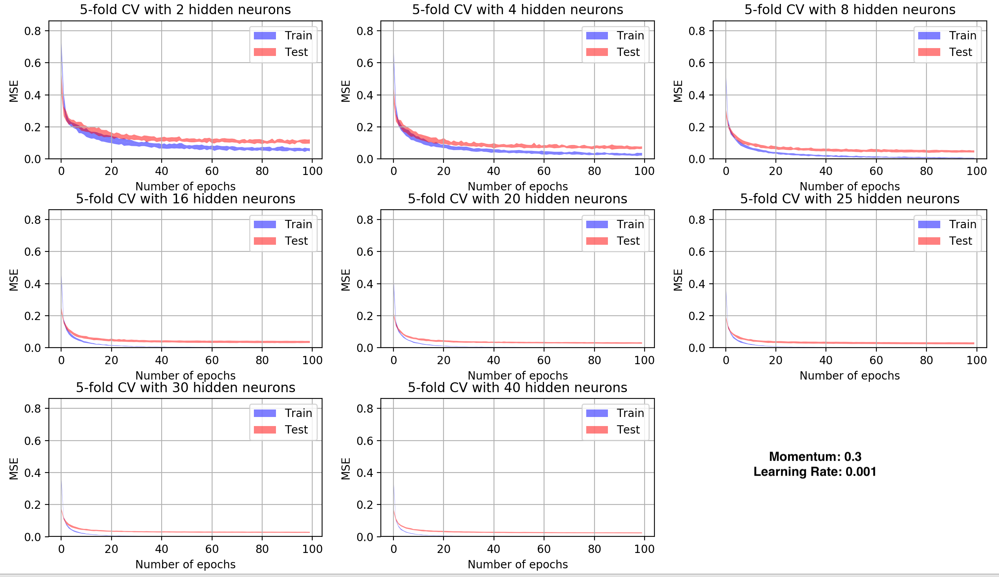  
*Figure 7*  
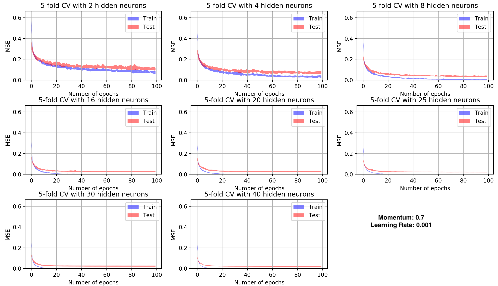  
*Figure 8*  

After comparing *Figures 5, 7* and *8* we notice that the values of the MSE do not improve when we increase the Momentum. For the further experiments, we will stick to *M* = 0.1.  

__Number of neurons in the hidden layer and number of epochs__  

*Figures 5* shows that the system with the chosen *L* and *M* parameters performs well for __number of neurons__ in the hidden layer *N* = 16, 25 and 30. To chose a better *N*, let's have a closer look to the values of the MSE for these *N* values:  
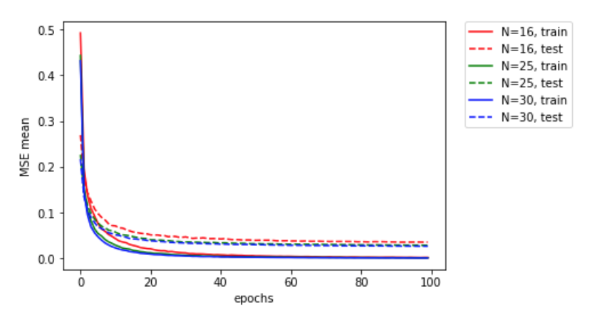  
*Figure 9*  
As we can see, the difference between the errors in case of *N*=25 and *N*=30 is barely noticeable. Thus, we will chose *N*=25.  
*Figure 9* also shows that the MSE does not change much for the number of epochs bigger than 60.  

__Final model__  

The hyperparameters are now set:  
```
M = 0.1      # momentum
L = 0.001    # learning rate
E = 60       # epochs
K = 5        # number of folds
N = 25       # number of neurons
N_TESTS = 10 # number of tests
```  
With this configuration the performance of the model is:  
* `MSE training:`  0.0028  
* `MSE test:`  0.0275  
* `Confusion Matrix:`       
[[746.   7.]  
 [  8. 911.]]

After performing a few tests on our model using the function `mf_predict()`, we notice that the model distinguishes well men and women natural voices and recognizes the kids' voices as the female ones. But when it comes to synthetized voices, the model seems to have troubles on distinguishing men and women voices.  

#### 3.2. Woman vs. Kid  
First of all, we will try to use the same NN configuration to build the model.  
Below is the resulting performance parameters:  
* `MSE training:`  0.02432212102038505
* `MSE test:`  0.08778795430088646
* `Confusion matrix:`  
[[2811.   55.]  
 [  51.  868.]]  

The `MSE_test` value should be improved.  

__Learning rate__  
*Figures 10* and *11* below represent the train and test MSE for the Momentum equal to 0.1 and Learning rate equal to 0.001 and 0.01 respectively.  

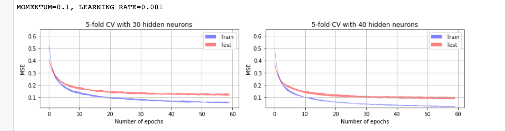  
*Figure 10*
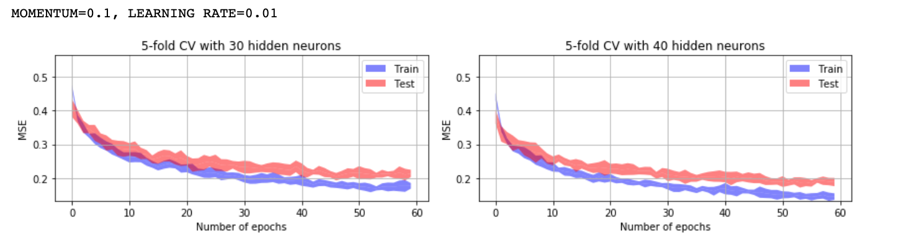  
*Figure 11*  

The performance of the system decreases when the *L* (Learning Rate) value grows.  

__Momentum__  
Now let's see what happens to the performance of the model if the *M* (Momentum) value grows.  

| M = 0.1        | M = 0.3           |
|:-------------:|:-------------:|
|       | 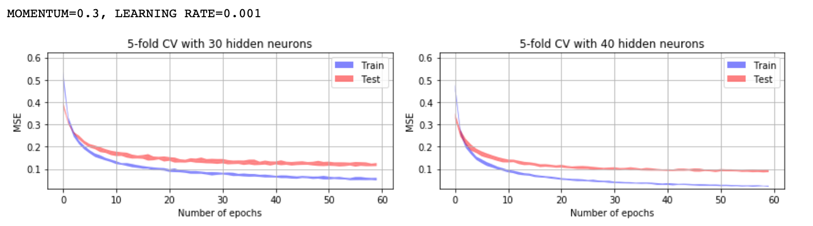|

| M = 0.5        | M = 0.7           |
|:-------------:|:-------------:|
| 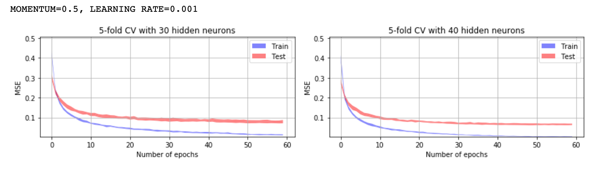      | 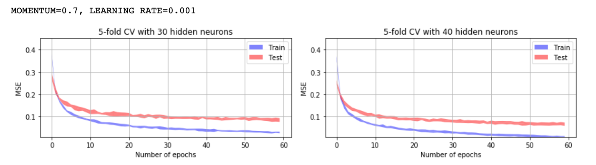|

| M = 0.9        |
|:-------------:|:-------------:|
| 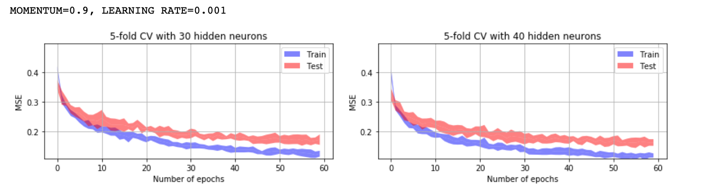      | |   
*Figure 12*  

*M* = 0.5 is gives the best MSE values without making the MSE values noisy.   

__Numer of Epochs, Number of Neurons in the hidden layer__  

Now we will see if the model can be improved by increasing the number of epochs and the number of neurons in the hidden layer.  

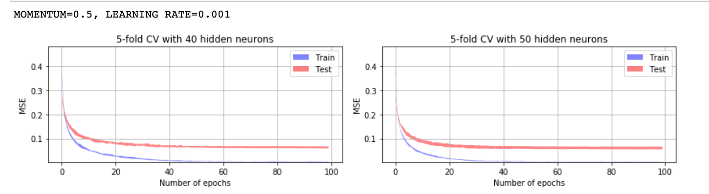  
*Figure 13*  

*Figure 13* shows that the performance of the model does not improve if we increase these two parameters.  

__Final Model__  

Below is the list of all the final hyperparameters:  
```
M = 0.5      # momentum
L = 0.001    # learning rate
E = 60       # epochs
K = 5        # number of folds
N = 40       # number of neurons
N_TESTS = 10 # number of tests
```  

The resulting performance for this configuration is:  
* `MSE training:`  0.0056
* `MSE test:`  0.0740
* `Confusion matrix:`  
[[2810.   56.]  
 [  33.  886.]]  

__Comparison with the initial model__  

 We succeeded to improve well the training error. The number of False Positives is decreased. The testing error is also slightly improved (of around 0.01).  

 __Making predictions__  

 After performing several predictions on the audios using the funciton `wk_predict()`, we notice that the model distinguishes well between the female's and kid's natural voices. It also makes the right predictions on female's synthetized voices. But sometimes it classifies the kid's synthetized voice as the female one. The model also tends to recognize the male voice as the female one. This result is intuitive and corresponds to our expectations.


#### 3.3 Man vs. Woman vs. Kid
